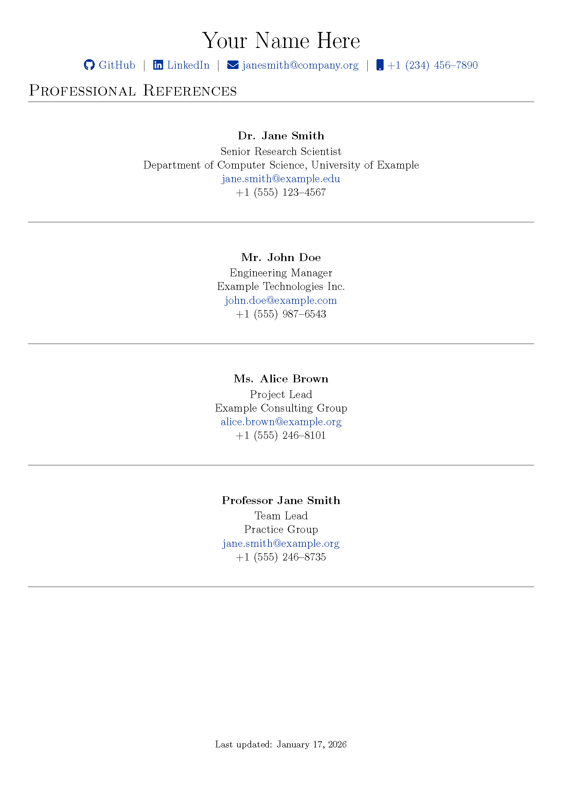

# Professional-References

Hello! This is a professional references template for public use of cloning and redistribution.
The structure, styling, and header of this document are inspired by [jitinnair1’s Auto CV](https://github.com/jitinnair1/autoCV), a project that demonstrates how a résumé can be generated and hosted via GitHub. That project influenced both the design of this template and the approach I used to create my own professional references document.

[View the PDF](references.pdf)

## Build Instructions & Requirements
### Requirements

To build the PDF locally, you will need:
- Python 3
- A LaTeX distribution (e.g., TeX Live, MacTeX, or MiKTeX)
    - Windows: [MiKTeX](https://miktex.org/download)
    - MacOS: [MacTex](https://www.tug.org/mactex/)
- `pdflatex` available in your system path. It should come with your LaTeX distributible.  

### How to Build
In the repository, you'll see `build.py`. 

Running `python3 build.py` in the root directory builds a `.pdf` version of your `references.tex`. The script runs continuously (using `-interaction=nonstopmode` in the `subprocess` execution), so any changes to `references.tex` will automatically trigger a rebuild.

### Customization

To customize the document:

- Edit `references.tex` with your own reference information

- Adjust formatting or layout as needed to match your preferences. The formatting is meant to match the `AutoCV` repository mentioned above

## What's next?
I aim to make this more user-friendly, so that a user does not need to know LaTeX or Python to build and utilize. This is to encourage open-source distribution of software resources. This will be done through plaintext data.

Next, I plan to support generating `references.tex` from a plaintext data file (e.g., `references.txt` or `references.csv`). This will make it easier to update references without editing LaTeX directly and will enable validation (required fields, consistent formatting) before rebuilding the PDF. This also likely will entail creating a new latex environment such as `contact` or `singularReference`, and reading K-V pairs into it.
